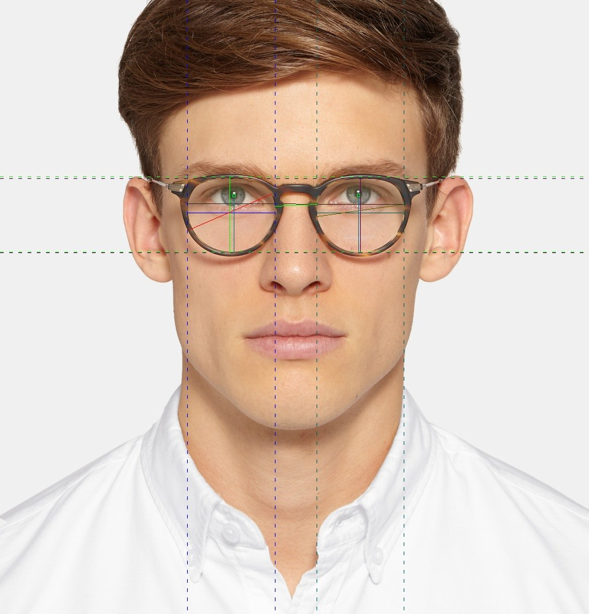

# MAD (Medidor de Lentes Digital)

## Project Overview

MAD (Medidor de Lentes Digital) is an API designed to process images of individuals wearing glasses. It calculates various measurements, including the pupillary distance and the iris height within the lens, using the provided horizontal and vertical lens measurements. The API returns these measurements in a user-friendly format.

## Table of Contents
1. Installation
2. Usage
3. API Endpoints
4. Example
5. Contact

## Installation

To install the necessary dependencies, ensure you have Python installed and run the following command:

```bash
pip install -r requirements.txt
```

## Usage

To use the API, send an image along with the horizontal and vertical lens measurements to the specified endpoint. Below is an example of how to use the API.

## API Endpoints
`/saveframehead`

- **Method**: POST
- **Description**: Receives an image and lens measurements to calculate the pupillary distance and iris height.
- **Parameters:**
  - **`image`**: The image of a person wearing glasses.
  - **`med_hor`**
  - **`med_vert`**

## Example
Here is an example of how to send a request to the **`/saveframehead`** endpoint:

```python
import requests

url = "http://your-api-url/saveframehead"
image_path = "path_to_your_image.png"
files = {"image": open(image_path, "rb")}
data = {
    "med_hor": 50,  # Replace with actual horizontal measurement
    "med_vert": 30  # Replace with actual vertical measurement
}

response = requests.post(url, files=files, data=data)
print(response.json())
```